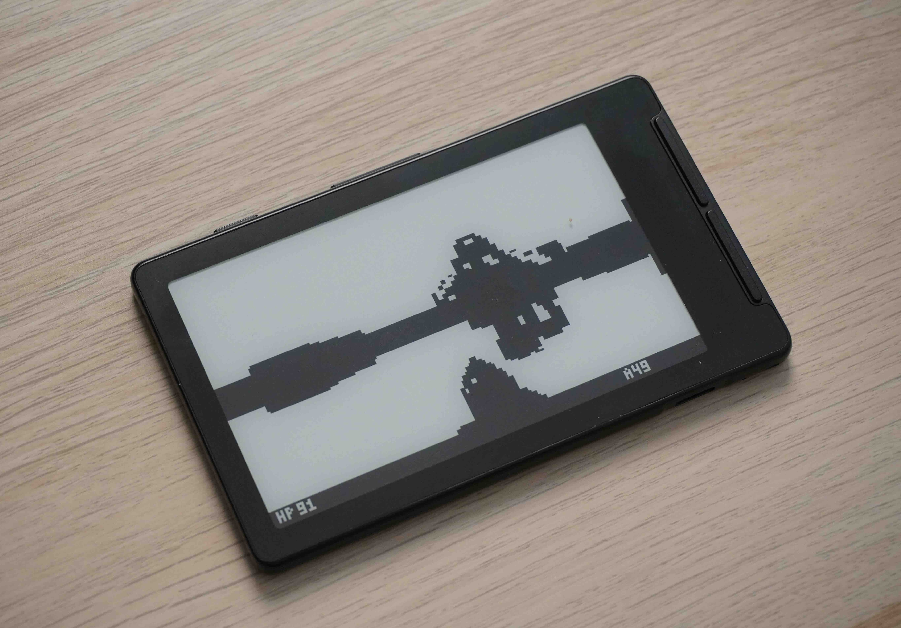

# doom-xt4

> **⚠️ Disclaimer:** This project involves flashing custom firmware onto your Xteink X4. Proceed at your own risk. I take no responsibility for any damage to your device, data loss, or any other consequences resulting from building or flashing this firmware. Make sure you know what you are doing before attempting to use this.


A DOOM-inspired raycaster running on the [XTeink X4](https://amzn.to/3QGpF3R) — an ESP32-C3 device with an 800×480 e-ink display.

Not a real DOOM port. A Wolfenstein-style raycaster engine built from scratch using DOOM's open-source sprites, designed specifically around the constraints of e-ink: 1-bit rendering, slow refresh, and no backlight.



---

## Features

- Raycaster engine with DDA wall projection and Z-buffered sprite rendering
- 4 enemy sprites with walk animation (200ms frame cadence)
- Pistol with recoil animation and muzzle flash
- HUD with HP and ammo counters
- Pause with full e-ink refresh for clean freeze-frame shots
- Title, win, and death screens
- Deep sleep on power-off with logo burn-in screen

---

## Hardware

| Component | Detail |
|---|---|
| MCU | ESP32-C3 |
| Display | SSD1677 e-ink, 800×480, 1-bit mono |
| Input | 7-button layout (D-pad + confirm + power) |

---

## Controls

The player **auto-walks forward** at all times. Turning is per-click.

| Button | Action |
|---|---|
| Up | Turn left |
| Down | Turn right |
| Right / Confirm | Shoot |
| Left | Pause / Resume |
| Power | Power off (deep sleep, logo on screen) |

---

## Flashing

### Web flasher (recommended)

Visit **[davidpavlicek36.github.io/doom-xt4](https://davidpavlicek36.github.io/doom-xt4)** in Chrome or Edge. No toolchain required — connect your device, click Install, and follow the on-screen instructions.

### Build from source

Requires [PlatformIO](https://platformio.org).

```bash
pio run --target upload
```

---

## Project structure

```
src/
  main.cpp          — Arduino entry point, input polling, e-ink render loop
  game/
    game.hpp        — Game loop, state machine, screen routing
    Player.hpp      — Player movement and state
    Entity.hpp      — Enemy type and AI
    map.h           — 16×16 tile map
    math.hpp        — Vector2 helpers
    InputData.hpp   — Input struct
    render/
      Camera.hpp    — Raycaster: walls, sprites, gun, HUD
      Screen.hpp    — 200×120 grayscale framebuffer + font
      sprites.h     — 1-bit sprite bitmaps (zombie, pistol)
      screens.h     — 1-bit title logo and death face bitmaps
```

---

## Credits

### [open-x4-epaper/community-sdk](https://github.com/open-x4-epaper/community-sdk)
Hardware abstraction layer for the XTeink X4 — `EInkDisplay`, `InputManager`, and `SDCardManager` drivers. This project would not exist without it.

### [Lode's Raycasting Tutorial](https://lodev.org/cgtutor/raycasting.html)
All raycasting code (DDA wall projection, Z-buffer, sprite projection) is derived from Lode Vandevenne's tutorial. No third-party raycaster library was used.

### [Freedoom](https://freedoom.github.io)
The zombie soldier sprite (`poss[a-d]5`) and pistol sprite (`pisga0`) are from the Freedoom free-content DOOM replacement, resized to 32×32 and converted to 1-bit C arrays. Released under an open license that permits redistribution.